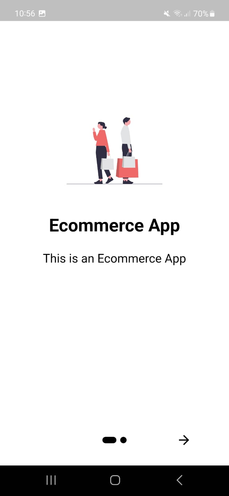

# ECOMMERCE APP

This is a repository for my Flutter UI training, where I'm learning new widgets and building user interfaces. Each link in this repository contains a different UI project.

Feel free to check out the code and provide feedback

## Links 
- [Project 1 hagman](https://github.com/julysNICK/hangman_mobile_flutter)
- [Project 2 guessing game](https://github.com/julysNICK/guessing_game)


## Screenshots
 # - Splash Screen


# - Onboarding Screen




# - Login Screen


# - Register Screen


# - Recover Password Screen


# - Verification Code Screen


# - Home Screen


# - Product Details Screen


# - Confirm Product Screen


# - Confirm Order Screen


# - Payment Screen


# - Address Screen


# - Confirm Order Screen


# - Success Screen


## Getting Started

To run the app, you'll need to have Flutter installed. Then, clone this repository, and run flutter run in the project directory
```
$ git clone
$ cd ecommerce_app
$ flutter run
```


## Contact
If you have any questions or feedback, feel free to contact me at julysmartins54@gmail.com.